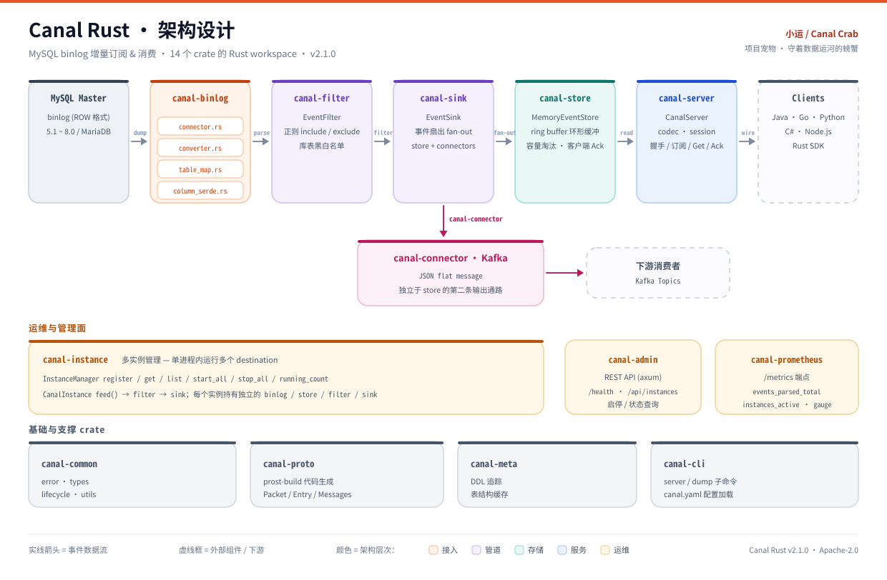
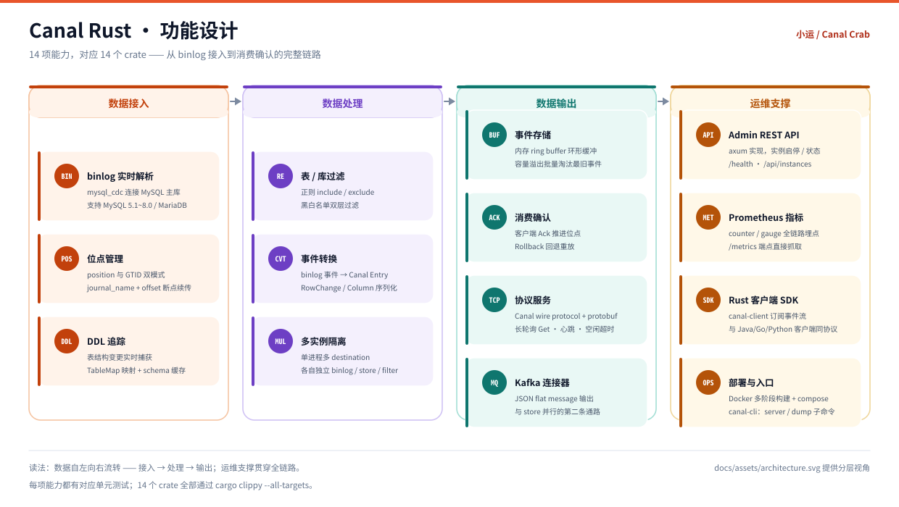
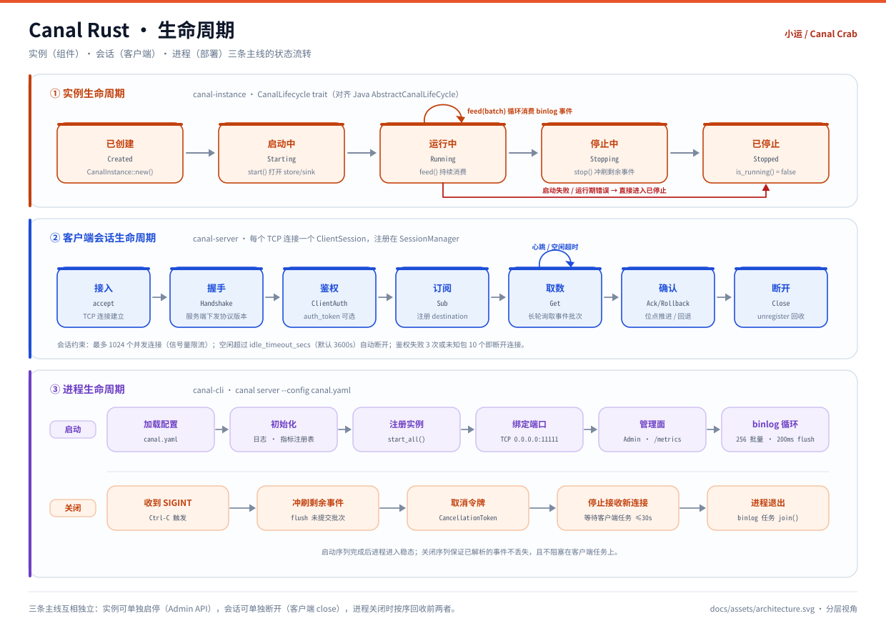

# Canal Rust

[English](README.en.md)

<p align="center">
  
</p>

<p align="center"><b>小运 · Canal Crab</b> —— 守在数据运河闸口上的螃蟹<br/>
<sub>左钳管着闸门水轮，右钳把变更事件送往下游</sub></p>

MySQL binlog 增量订阅 & 消费组件，使用 Rust 重写 [阿里巴巴 Canal](https://github.com/alibaba/canal)。

## 项目简介

Canal Rust 模拟 MySQL slave 的交互协议，向 MySQL master 发送 dump 请求，接收并解析 binary log 事件，通过 protobuf 协议提供给下游消费者。

14 个 crate 覆盖了一条完整的链路：**接入 → 解析 → 过滤 → 存储 → 输出 → 消费确认**，对外保持与 Java 版 Canal 完全一致的 wire protocol。

**核心能力：**

- **binlog 实时解析** — 基于 `mysql_cdc` 连接 MySQL 5.1~8.0 / MariaDB，支持 position 和 GTID 位点
- **协议兼容** — 复用 Canal 上游 `.proto`，现有 Java/Go/Python/C#/Node.js 客户端零改动接入
- **事件存储** — 内存 ring buffer，支持容量溢出自动淘汰和客户端消费 Ack
- **表/库过滤** — 正则表达式过滤，支持 include/exclude 模式
- **消息队列** — Kafka connector（JSON flat message）
- **多实例管理** — 单进程运行多个 Canal destination，各自独立 binlog/存储/过滤
- **可观测性** — Prometheus counter/gauge + `/metrics` 端点
- **管理 API** — RESTful Admin API（实例启停、状态查询）
- **Docker 部署** — 多阶段构建 + docker-compose

## 项目宠物

**小运（Canal Crab）** —— 一只锈红色的螃蟹，是这条数据运河的**闸官**。

设计上是把项目的职责直接画成了角色：MySQL 在上游不断产生变更，下游的消费者随时可能跟不上，中间需要有人**控制流量**。所以小运站在闸墙上，一只钳子拧着闸门水轮（决定放多少数据过去），另一只钳子托着一枚发光的事件，闸墙下的河水里漂着已经放行的数据包，上游还漂着一卷 binlog 日志。

| 画面元素 | 对应项目里的 |
|---|---|
| 锈红色外壳 | Rust |
| 闸门水轮 | `canal-store` 的环形缓冲与容量/淘汰控制 |
| 右钳托着的事件 | `canal-sink` 扇出的一条事件 |
| 闸下漂着的数据包 | `canal-server` 经 TCP 送达客户端 / `canal-connector` 投递 Kafka |
| 上游的 binlog 卷轴 | `canal-binlog` 从 MySQL 拉到的原始事件 |
| 脚下的运河 | 整条链路本身 |

### 小运住在代码里的哪些地方

矢量原图只有一份：[`docs/assets/canal-pet.svg`](docs/assets/canal-pet.svg)。它被 `include_str!` 编进二进制，所以**改 SVG 就等于改运行时**，不需要额外打包资源。

| 位置 | 形式 |
|------|------|
| `crates/canal-common/src/pet.rs` | 唯一真源：`PET_NAME` · `CANAL_CRAB`（ASCII）· `PET_SVG`（嵌入的矢量原图）· `banner()` |
| `canal --help` | 欢迎信息中打印 ASCII 版小运 |
| `canal pet` | 独立子命令，打印小运并告诉你它都在哪 |
| `canal server` 启动 | 日志里报到一行 |
| Admin API `GET /` | 浏览器打开管理端口就能看到小运 + 版本 / 运行时长 / 实例数 |
| Admin API `GET /pet.svg` | 直接返回矢量原图（`image/svg+xml`） |

放在 `canal-common` 是因为它是 CLI 与管理服务共同依赖的最底层 crate —— `canal-cli` 依赖 `canal-admin`，宠物放哪一边都会成环。

```
     \    \              /    /
      \    \____________/    /
    ___\_                  _/___
   /     o                o     \
  |               __              |
   \          \________/         /
    '.__________________________.'
   __/   /     |      |     \   \__
  |==================================|
  ~~~~~~~~~~~~~~~~~~~~~~~~~~~~~~~~~~~~
```

## 架构设计



**核心数据流：**

```
MySQL Master
    │  binlog dump (mysql_cdc)
    ▼
┌──────────────┐    ┌──────────────┐    ┌──────────────┐
│ Event        │───▶│ EventFilter  │───▶│ EventSink    │
│ Converter    │    │ (regex)      │    │ ┌─ store ───▶ Server ──▶ Client
│(TableMap映射) │    └──────────────┘    │ └─ connector─▶ Kafka
└──────────────┘                        └──────────────┘
```

**分层职责：**

| 层 | Crate | 职责 |
|----|-------|------|
| 接入 | `canal-binlog` | 连接 MySQL、拉取 binlog、转换为统一事件模型 |
| 处理 | `canal-filter` · `canal-sink` | 正则过滤库表、把事件扇出到多个出口 |
| 输出 | `canal-store` · `canal-server` · `canal-connector` | 环形缓冲存储、TCP 协议服务、Kafka 投递 |
| 编排 | `canal-instance` | 管理多个 destination，每个实例独占一条完整链路 |
| 运维 | `canal-admin` · `canal-prometheus` · `canal-cli` | 启停 API、指标暴露、命令行入口 |
| 基础 | `canal-common` · `canal-proto` · `canal-meta` | 类型 / 生命周期抽象、protobuf 生成、表结构缓存 |

## 功能设计



14 项能力与 14 个 crate 一一对应，分为**数据接入**、**数据处理**、**数据输出**、**运维支撑**四组；接入与处理决定"能拿到什么"，输出与运维决定"能送多远、看得多清"。

## 生命周期



三条主线互相独立，任一层异常都不会阻塞其余层级的优雅退出：

| 主线 | 承载者 | 状态流转 |
|------|--------|----------|
| **实例** | `canal-instance` | 已创建 → 启动中 → 运行中（`feed()` 循环）→ 停止中 → 已停止 |
| **会话** | `canal-server` | 接入 → 握手 → 鉴权 → 订阅 → 取数 → 确认 → 断开 |
| **进程** | `canal-cli` | 加载配置 → 初始化 → 注册实例 → 绑定端口 → binlog 循环 → SIGINT → 优雅关闭 |

## 项目设计

### 设计决策

| 决策 | 选择 | 理由 |
|------|------|------|
| 协议兼容 | 复用 Canal `.proto` | 存量客户端零改动 |
| binlog 解析 | `mysql_cdc` crate | 成熟 CDC 库，支持 MySQL/MariaDB |
| 异步运行时 | `tokio` | Rust 生态标准 |
| 序列化 | `prost` + `prost-build` | 纯 Rust protobuf |
| 事件存储 | 自定义 ring buffer | 零外部依赖，基于 `VecDeque` |
| 配置 | `serde_yaml` | YAML，与 Java 版 `properties` 对标 |
| 日志 | `tracing` | 结构化日志，span-based |
| Web 框架 | `axum` | Admin API + Prometheus 端点 |
| 构建 | Cargo workspace | 多 crate 独立编译 |

### Crate 依赖关系

```
canal-common ────────────────────────────────────────────── 基础类型
    │
    ├── canal-proto ─────────────────────────────────────── protobuf 代码生成
    ├── canal-binlog ──▶ canal-proto ────────────────────── binlog 解析
    ├── canal-store ─────────────────────────────────────── 事件存储
    ├── canal-filter ────────────────────────────────────── 表/库过滤
    │
    ├── canal-sink ──▶ canal-store + canal-filter ──────── 事件管道
    ├── canal-connector ──▶ canal-sink ──────────────────── Kafka 输出
    ├── canal-instance ──▶ binlog + store + filter + sink ─ 多实例管理
    ├── canal-server ──▶ store + binlog + proto ─────────── TCP 协议服务
    ├── canal-client ──▶ proto ──────────────────────────── Rust SDK
    ├── canal-meta ──▶ common ───────────────────────────── 表结构缓存
    ├── canal-admin ──▶ instance ────────────────────────── REST API
    ├── canal-prometheus ────────────────────────────────── metrics
    │
    └── canal-cli ──▶ server + store + binlog + common ──── 命令行入口
```

### 技术选型对照

| 组件 | Java Canal | Canal Rust |
|------|-----------|------------|
| 语言 | Java 8 | Rust (stable) |
| 运行时 | JVM | Native binary (AOT) |
| 网络框架 | Netty 4.x | `tokio` + `tokio-util` codec |
| 序列化 | Protobuf 3 (java) | `prost` |
| Binlog | `dbsync` 自研 | `mysql_cdc` |
| 事件存储 | LMAX Disruptor | 自定义 ring buffer |
| DI 容器 | Spring 5 | 构造函数注入 |
| 配置 | Spring properties | `serde_yaml` |
| 日志 | Logback + SLF4J | `tracing` |
| SQL 解析 | Druid | `sqlparser` |
| 构建工具 | Maven | Cargo |
| 表达式引擎 | Aviator | `regex` |

## 快速开始

### 环境要求

- Rust 1.85+（依赖链中 `clap` 等已使用 edition 2024，需 rustc ≥ 1.85）
- **`protoc`**（Protocol Buffers 编译器）—— `canal-proto` 的 `build.rs` 用 `prost-build`
  生成代码，缺了它**任何编译都会失败**并报 `Could not find 'protoc'`
  - Debian/Ubuntu：`apt-get install protobuf-compiler`
  - macOS：`brew install protobuf`
- MySQL 5.7+ / 8.0（开启 binlog，格式 ROW）
- （可选）Kafka 用于消息队列输出

### 安装

```bash
git clone https://github.com/erikwang2013/canal-rust.git
cd canal-rust
cargo build --release
```

### 配置 MySQL 主库

```sql
CREATE USER 'canal'@'%' IDENTIFIED WITH mysql_native_password BY 'canal';
GRANT SELECT, REPLICATION SLAVE, REPLICATION CLIENT ON *.* TO 'canal'@'%';
FLUSH PRIVILEGES;

SHOW VARIABLES LIKE 'log_bin';
SHOW MASTER STATUS;
```

> **⚠️ 连接是明文的。** 上游 `mysql_cdc 0.2.1` 完全未实现 TLS —— 它对任何非 `Disabled` 的
> `SslMode` 直接 `unimplemented!()` panic，所以本项目只能以明文连接 MySQL，账号密码与
> binlog 数据都不加密。请只在可信内网使用，跨网段请套 SSH 隧道。
>
> **认证插件限制**：`mysql_cdc` 只支持 `mysql_native_password` 和 `caching_sha2_password`。
> 若账号用了 `sha256_password`，连接会以
> `sha256_password auth plugin is not supported.` 失败 —— 这正是上面建账号时显式指定
> `IDENTIFIED WITH mysql_native_password` 的原因。

### 配置 canal.yaml

```yaml
canal:
  mysql:
    host: "127.0.0.1"
    port: 3306
    username: "canal"
    password: "canal"
  store:
    buffer_size: 16384
  server:
    bind: "0.0.0.0:11111"
    metrics_bind: "127.0.0.1:9090"
  logging:
    level: "info"
    format: "json"
```

### 启动服务

```bash
cargo run --release -- server --config canal.yaml
cargo run --release -- --help
```

### 使用客户端连接

```rust
use canal_client::CanalClient;

#[tokio::main]
async fn main() -> Result<(), Box<dyn std::error::Error>> {
    let mut client = CanalClient::new("127.0.0.1", 11111)
        .with_destination("example");

    client.connect().await?;
    let mut stream = client.subscribe(None).await?;

    while let Some(Ok(event)) = stream.next_event().await {
        println!("{}: {} @ {}.{}", event.journal_name, event.position,
                 event.schema_name, event.table_name);
    }
    Ok(())
}
```

### Docker 部署

```bash
docker compose -f docker/docker-compose.yml up -d
```

## 项目结构

```
canal-rust/
├── Cargo.toml                      # Cargo workspace，14 个成员 crate
├── canal.yaml                      # 默认配置文件
├── canal.yaml.example              # 带注释的配置模板
├── rust-toolchain.toml             # Rust 工具链固定（stable + rustfmt + clippy）
├── Makefile                        # build / test / clippy / fmt / check 快捷入口
├── README.md                       # 本文件（中文）
├── README.en.md                    # English README
├── proto/                          # Canal 上游 .proto 文件
│   ├── CanalProtocol.proto         # 主协议（Packet, Handshake, Messages）
│   └── EntryProtocol.proto         # 事件定义（Entry, RowChange, Column）
├── docker/                         # Docker 部署
│   ├── Dockerfile                  # 多阶段构建
│   └── docker-compose.yml          # 一键启动
├── crates/                         # 14 个成员 crate
│   ├── canal-common/               # 基础类型
│   │   └── src/ {error, types, lifecycle, utils}.rs
│   ├── canal-proto/                # protobuf 代码生成（prost-build）
│   │   ├── build.rs
│   │   └── src/ {lib, com.alibaba.otter.canal.protocol}.rs
│   ├── canal-binlog/               # MySQL binlog 解析层
│   │   └── src/ {connector, converter, table_map, column_serde}.rs
│   ├── canal-store/                # 事件存储：ring buffer + 位点管理
│   │   └── src/memory.rs
│   ├── canal-filter/               # 正则表/库过滤（include/exclude）
│   │   └── src/lib.rs
│   ├── canal-sink/                 # 事件分发管道（store + connector 扇出）
│   │   └── src/ {sink, connector}.rs
│   ├── canal-connector/            # Kafka 连接器
│   │   └── src/ {kafka, kafka_tests_extra}.rs
│   ├── canal-instance/             # 多实例管理
│   │   └── src/instance.rs
│   ├── canal-server/               # TCP 服务（Canal wire protocol）
│   │   └── src/ {codec, session, server, conversion}.rs
│   ├── canal-client/               # Rust 客户端 SDK
│   │   └── src/lib.rs
│   ├── canal-meta/                 # DDL 追踪 + 表结构缓存
│   │   └── src/lib.rs
│   ├── canal-admin/                # REST Admin API（Axum）
│   │   └── src/lib.rs
│   ├── canal-prometheus/           # Prometheus metrics 端点
│   │   └── src/metrics_server.rs
│   └── canal-cli/                  # 命令行入口（server / dump）
│       └── src/ {main, lib}.rs     # lib.rs 含 CLI 定义、配置加载与项目宠物
├── docs/
│   ├── assets/                     # 图片资源
│   │   ├── canal-pet.svg           # 小运 · 项目宠物
│   │   ├── architecture.svg        # 架构设计图
│   │   ├── functions.svg           # 功能设计图
│   │   └── lifecycle.svg           # 生命周期图
│   ├── superpowers/
│   │   ├── specs/2026-07-30-canal-rust-rewrite-design.md   # 完整设计文档
│   │   └── plans/2026-07-30-canal-rust-phase1.md           # 第一期实现计划
│   └── review-report-*.md          # 历次代码评审 / 测试报告
```

> 没有顶层 `tests/` 目录：测试不集中放置，而是与源码同 crate 维护。

- 单元测试：`crates/*/src/tests*.rs`、`#[cfg(test)] mod tests`
- 集成测试：`crates/*/tests/*.rs`（如 `canal-server/src/tests_e2e.rs`、`canal-client/tests/e2e.rs`）

## 项目统计

| 指标 | 数值 |
|------|------|
| Crates | 14 |
| Rust 源码行数 | ~8,400 |
| 测试代码行数 | ~3,900 |
| 单元/集成测试 | 389（全部通过） |
| Protobuf 定义 | 2 |
| 版本 | v2.2.0 |
| Clippy 警告 | 0 |
| 许可协议 | Apache-2.0 |

## 使用教程

### 场景 1：数据库实时同步到 Kafka

```yaml
canal:
  mysql:
    host: "10.0.0.1"
    username: "replicator"
    password: "secret"
  filter:
    pattern: "mydb\\..*"
```

```rust
use canal_connector::kafka::{KafkaConfig, KafkaConnector};
use canal_instance::{CanalInstance, InstanceConfig};
use canal_common::{FilterPattern, LogPosition};
use std::sync::Arc;

let kafka_config = KafkaConfig::new("localhost:9092", "mysql-changes");
let kafka = Arc::new(KafkaConnector::new("kafka-sync", kafka_config).unwrap());
let config = InstanceConfig {
    destination: "mydb-sync".into(),
    mysql_host: "10.0.0.1".into(),
    mysql_port: 3306,
    mysql_username: "replicator".into(),
    mysql_password: "secret".into(),
    mysql_server_id: 2001,
    start_position: LogPosition::new("mysql-bin.000001", 4),
    filter: FilterPattern { pattern: "mydb\\..*".into(), black_list: "".into() },
    store_buffer_size: 16384,
    connector_names: vec!["kafka-sync".into()],
};
```

### 场景 2：多实例部署

```rust
let manager = InstanceManager::new();

manager.register(CanalInstance::new(
    InstanceConfig { destination: "prod".into(), ... }, vec![kafka_prod],
)).await;

manager.register(CanalInstance::new(
    InstanceConfig { destination: "test".into(), ... }, vec![kafka_test],
)).await;

manager.start_all().await?;
```

### 场景 3：Prometheus 监控

```bash
curl http://localhost:9090/metrics
# canal_events_parsed_total 150000
# canal_events_dispatched_total 146800
# canal_instances_active 2
```

### 场景 4：Admin API 管理实例

Admin API 的监听地址规则：默认是**主端口 + 1 且仅绑定回环地址**（`bind: 127.0.0.1:11111` → `127.0.0.1:11112`）。要让它对外可达，必须显式配置 `server.admin_bind`，否则容器/远端永远连不上：

```yaml
canal:
  server:
    bind: "0.0.0.0:11111"
    admin_bind: "0.0.0.0:11112"   # 不配置则固定为 127.0.0.1:{主端口+1}
```

```bash
curl http://localhost:11112/health
curl http://localhost:11112/api/instances
curl -X POST http://localhost:11112/api/instances/default/stop
```

直接用浏览器打开 `http://localhost:11112/` 会看到小运和实时状态（版本 / 运行时长 / 实例数）—— 这是无需 token 的落地页，只显示计数、不显示实例名；实例名仍要通过带 token 的 `/api/instances` 获取。

## 开发

```bash
cargo build --release              # 编译
cargo test --all                   # 运行测试
cargo clippy --all-targets -- -D warnings  # 代码检查（与 CI 一致）
cargo fmt --check --all            # 格式检查
cargo doc --open                   # 文档
```

## 相关资源

- [阿里巴巴 Canal (Java)](https://github.com/alibaba/canal)
- [mysql_cdc crate](https://crates.io/crates/mysql_cdc)
- [Canal Protocol 文档](https://github.com/alibaba/canal/wiki/ClientAPI)

## 许可

Apache License 2.0

---

## 欢迎支持

如果这个项目对你有帮助，欢迎扫码支持一杯咖啡 ☕

<p align="center">
  <table align="center">
    <tr>
      <td align="center" width="200">
        <br/>
        <b>微信支付</b>
      </td>
      <td align="center" width="200">
        <br/>
        <b>支付宝</b>
      </td>
    </tr>
  </table>
</p>
